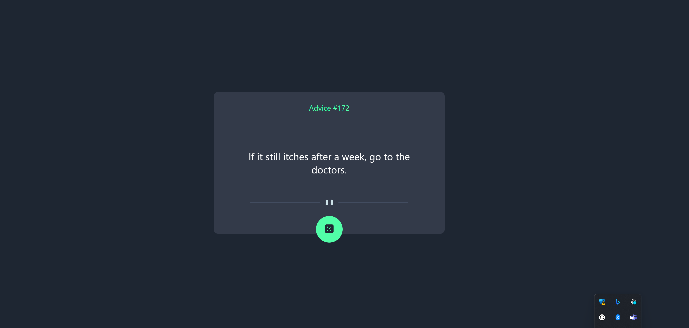

# Advice Generator

This repository contains the source code for the Advice generator app.

## Description

This was a Frontend Mentor challenge that I used to refresh myself on fetching data from third-party APIs. The UI was built using React, and it uses the Advice Slip API to generate random quotes.

## Credits

Quotes taken from Advice Slip API:

https://api.adviceslip.com/

Design belongs to Frontend Mentor:

https://www.frontendmentor.io/
